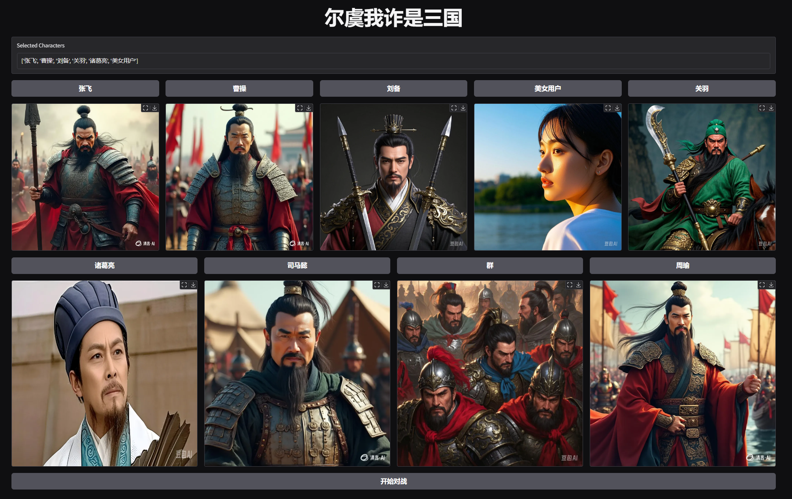
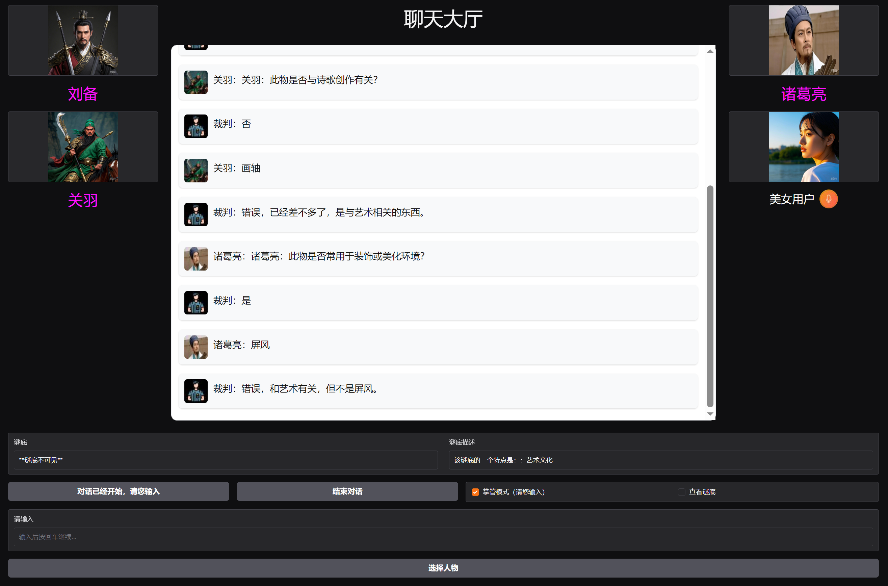

# SanGuo_Play

# 简介

与三国人物一起进行聊天游戏的界面。基于Gradio开发。这个项目当中含有了丰富的gradio代码。基于Lora微调，对不同的三国人物角色数据进行训练，在运行时自动加载对应的模块来模拟人物的语气对话。数据来源于爬虫。
游戏规则：这是一个基于“二十问”的简易版游戏。玩家需要根据线索猜出谜底。玩家需要根据提示，向裁判提出一个问题，裁判会回答是或者否。然后玩家会猜测一个谜底词语，裁判会告诉玩家是否正确并给予相应提示。

第一步：选择人物

第二步：开始对战

如果没有选择了美女用户：
系统将会召集群雄自动对战
如果选择了美女用户：
用户可以开启掌管模式参与对战

## 虚拟环境配置

可以使用以下命令根据 environment.yml 文件创建相同的虚拟环境：

conda env create -f environment.yml

## 运行命令

cd sanguo_play

### API模式（不需要本地加载模型，无显卡版本）

需要用户去项目配置文件：sanguo_play/api_qwen/guiji_qwen7B.py
修改下面配置：
url = "https://api.siliconflow.cn/v1/chat/completions"
api_key = "*****"

我是基于siliconflow测试的，大家可以自行配置其他api

最后运行：
python web_gradio.py --api_mode True

### download模式（需要本地加载模型，Lora微调版本）

python web_gradio.py --api_mode False --model_path "Qwen/Qwen2.5-7B-Instruct"

需要用户自行微调 三国演义人物，微调教程我放置在：

sanguo_play/all_characters/dir_path.py中可以自行配置人物名称和头像，但是需要有对应的微调模型权重，需要与项目路径一致。

